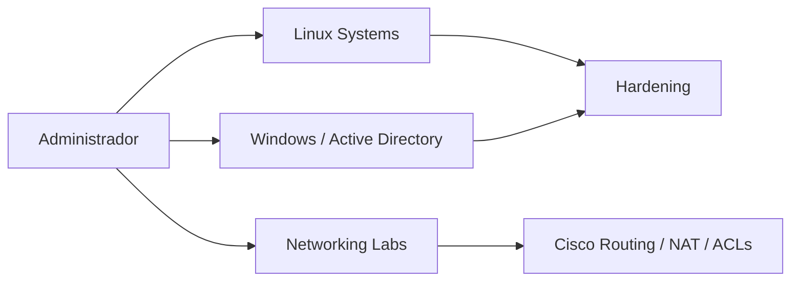
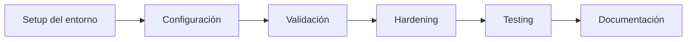

# 🧪 ASIR Labs & Projects

Repositorio de **laboratorios técnicos reales** enfocados en Sistemas, Redes y Ciberseguridad.

Cada laboratorio simula un entorno práctico basado en escenarios reales de trabajo en IT, donde se despliegan, configuran y aseguran infraestructuras.

---

## 🏷️ Badges


---

## 📑 Índice

1. [Descripción del Proyecto](#descripción-del-proyecto)
2. [Arquitectura](#arquitectura)
3. [Flujo de Trabajo](#flujo-de-trabajo)
4. [Onboarding](#onboarding)
5. [Scripts del Proyecto](#scripts-del-proyecto)
6. [Checklist Final](#checklist-final)
7. [Documentación Adicional](#documentación-adicional)

---

## 📘 Descripción del Proyecto

* **Tipo de proyecto:** Laboratorios técnicos (Sysadmin / Networking / Security)
* **Stack principal:** Linux, Windows Server, Active Directory, Cisco, SQL
* **Objetivo:** Simular entornos reales para adquirir experiencia práctica
* **Entornos:** Local / Virtualizado (VMs, redes simuladas)

---

## 🧱 Arquitectura



📌 Descripción:

* Los laboratorios cubren múltiples áreas conectadas entre sí.
* Se simulan entornos híbridos (Linux + Windows + Red).
* Se aplican configuraciones reales y medidas de seguridad.

---

## 🔄 Flujo de Trabajo



📌 Flujo aplicado en cada laboratorio:

1. Despliegue del entorno
2. Configuración de servicios
3. Validación funcional
4. Aplicación de medidas de seguridad
5. Pruebas
6. Documentación

---

## 🚀 Onboarding

```bash
# Clonar repositorio
git clone https://github.com/TUUSUARIO/ASIR-labs.git
cd ASIR-labs
```

📌 Uso:

* Accede a cualquier carpeta de laboratorio
* Sigue la documentación incluida paso a paso
* Replica el entorno en tu máquina local

---

## 🛠️ Scripts del Proyecto

Actualmente los laboratorios se ejecutan manualmente mediante documentación técnica.

🚧 Futuras mejoras:

* Scripts de automatización en Bash
* Despliegue automático de entornos
* Validaciones automatizadas

---

## ✅ Checklist Final

* [ ] README actualizado
* [ ] Laboratorios documentados
* [ ] Configuraciones verificadas
* [ ] Evidencias incluidas
* [ ] Estructura clara del repositorio

---

## 📚 Documentación Adicional

* `docs/` → documentación técnica de los laboratorios
* `screenshots/` → evidencias visuales
* Archivos internos de cada laboratorio con instrucciones detalladas

---

© 2026 D4NYED

